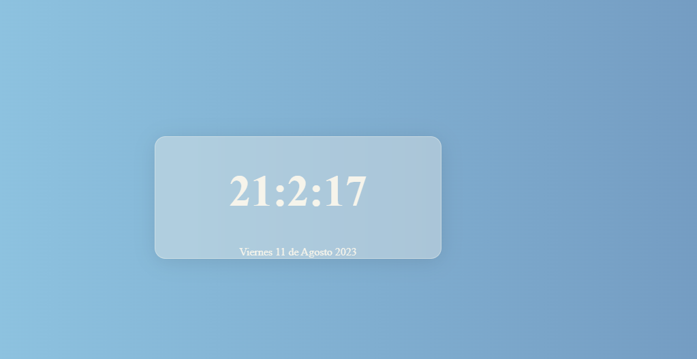

# Reloj digital

Es un programa que muestra la hora y la fecha actual en formato digital. El programa está hecho con HTML, CSS y JavaScript, se puede usar como un reloj en el navegador y es un proyecto sencillo pero útil para practicar.

